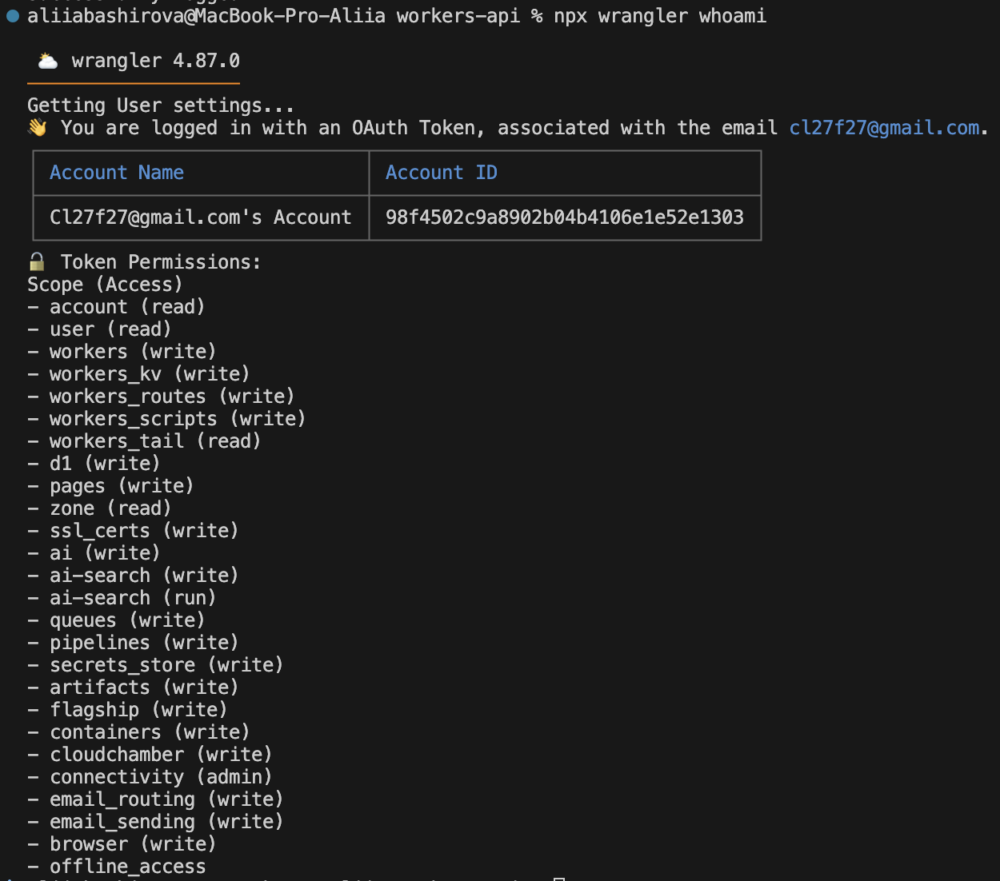

# Lab 17 — Cloudflare Workers Edge Deployment

## Task 1 — Cloudflare Setup

### Account & Project Creation

- **Cloudflare Account:** Created at https://dash.cloudflare.com
- **Project Name:** `workers-api`
- **Template:** Worker only (TypeScript)
- **Workers.dev Subdomain:** `aliiabashirova-workers`

### Wrangler CLI Authentication


### Project Structure
```text
workers-api/
├── src/
│   └── index.ts          # Worker source code
├── wrangler.jsonc        # Worker configuration
├── package.json
└── tsconfig.json
```

### Platform Concepts
| Concept	| Explanation |
| --------- | ----------- |
| Workers Runtime |	Lightweight V8 isolate-based serverless environment |
| workers.dev	| Free subdomain for deploying Workers (e.g., *.workers.dev) |
| Bindings |	Resources attached to Worker (vars, secrets, KV namespaces) |

## Task 2 — Worker API Implementation

### Implemented Endpoints
| Method	| Path	| Description |
| --------- | ----- | ----------- |
| GET	| /	| Application information and available endpoints |
| GET	| /health	| Health check with version and timestamp |
| GET	| /edge	| Edge metadata (colo, country, city, etc.) |
| GET	| /counter	| Get persistent counter value from KV |
| POST	| /counter	| Increment persistent counter |

### Local Development


### Deployment


## Task 3 — Global Edge Behavior
### Edge Metadata Endpoint (`/edge`)


### How Global Distribution Works
Cloudflare Workers runs on Cloudflare's network of 300+ data centers worldwide:

1. **Deploy once** — Worker is automatically deployed to all edge locations

2. **No region selection** — No manual choice of deployment regions

3. **Request routing** — User requests are routed to the nearest edge location

4. **Low latency** — Typical latency of 10-50ms worldwide

Benefits vs Traditional PaaS:

- **No "deploy to 3 regions" step** — Global by default

- **No region selection decisions** — You don't need to predict user geography

- **Automatic failover** — If one edge location has issues, traffic routes elsewhere

### Routing Concepts
| Concept	| Description	| Use Case |
| --------- | ------------- | -------- |
| workers.dev	| Free subdomain (*.workers.dev) |	Quick testing, demos, development |
| Routes	| Attach Worker to traffic on a zone	| Production apps on existing domain |
| Custom Domains	| Worker as origin for a domain	 |Branded API endpoints |

## Task 4 — Configuration, Secrets & Persistence

### Environment Variables (`wrangler.jsonc`)

```json
{
    "name": "workers-api",
	"main": "src/index.ts",
	"compatibility_date": "2026-05-03",
	"vars": {
		"APP_NAME": "edge-api",
		"APP_VERSION": "1.1.0"
	},
}
```
**Why plaintext vars ≠ secrets:** Plaintext vars are stored in `wrangler.jsonc` and committed to Git. Secrets are encrypted and never appear in version control.

### KV Persistence (Counter)


## Task 5 — Observability & Operations

### Logs


### Metrics (Cloudflare Dashboard)
Available metrics in dashboard:

- Request Count — Total requests to Worker

- Duration — P99, P50 latency

- CPU Time — CPU usage per request

- Errors — 4xx/5xx error counts

### Deployment History (with rollback)


## Task 6 — Kubernetes vs Cloudflare Workers Comparison

### Comparison Table
| Aspect	| Kubernetes	| Cloudflare Workers |
| --------- | ------------- | ------------------ |
| Setup complexity	| High — cluster setup, networking, storage, ingress	| Low — npm create cloudflare, npx wrangler deploy
| Deployment speed	| 30s-2min (image build + pull + rollout)	| ~10s (direct upload to edge)|
| Global distribution	| Manual region selection, multiple clusters	| Automatic (300+ locations, one deploy)|
| Cost (for small apps)	| ~$10-50/month (cluster + compute)	| Free (100k requests/day)| 
| State/persistence model	| PVCs, StatefulSets, external DBs	| Workers KV (eventual consistency), D1, R2| 
| Control/flexibility	| Full — any container, any runtime, custom networking	| Limited — JS/WASM only, restricted APIs |
| Cold start	| No (pods always running)	| Rare (but can happen, ~5ms) |
| Best use case	| Complex microservices, stateful workloads, custom runtimes	| Global APIs, edge logic, auth proxies, lightweight services |

### When to Use Each
| Scenario	| Recommendation	| Why |
| --------- | ----------------- | --- |
| Global API with low latency requirements	| Workers	| Automatic global distribution, built-in CDN |
| Complex microservice architecture	| Kubernetes	| Service mesh, internal networking, multiple containers |
| Machine learning inference	| Kubernetes	| GPU support, custom runtimes, large binaries |
| Authentication/authorization proxy	| Workers	| Edge execution, low latency, simple logic |
| Database with persistent storage	| Kubernetes |	StatefulSets, volume management, ACID requirements |
| Static site with API	| Workers	| Built-in CDN, serverless functions |
| WebSocket/long-running connections	| Kubernetes	| Better support, longer timeout limits |

### Reflection
 - What felt easier than Kubernetes?
 
    - Zero infrastructure setup — npx wrangler deploy worked immediately

    - Global distribution without any configuration

    - Built-in HTTPS and workers.dev URL

    - Logs and metrics available out of the box

 - What felt more constrained?

    - Limited to JavaScript/TypeScript/WebAssembly

    - KV is eventually consistent (not for critical counters without retries)

    - No support for long-running WebSockets (limited to ~1 minute)

    - Cannot run arbitrary Docker images or binaries

- What changed because Workers is not a Docker host?

    - No Dockerfile needed

    - No image registry management

    - Different mental model (edge functions vs long-running processes)

    - Use platform bindings (KV, D1) instead of persistent volumes